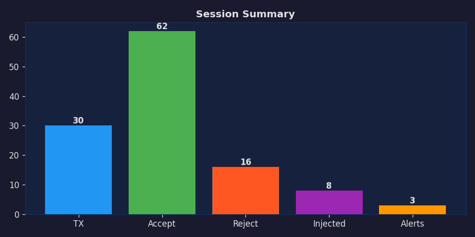
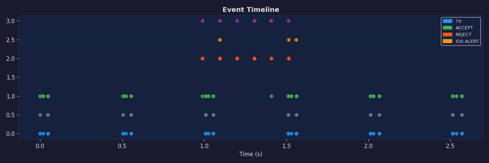

# 🚗🔐 Car Security Simulator

> **An automotive CAN-bus security research platform** — it simulates an in-vehicle
> network of ECUs and lets you launch real attack techniques against it, then
> defends with **AUTOSAR SecOC**, a **CAN intrusion-detection system**, and
> **UDS Security Access**. Runs entirely in-process *or* on a real (virtual) CAN
> bus via `python-can`.

[](https://github.com/Je1al/car-security-simulator/actions/workflows/ci.yml)
[](https://www.python.org/)
[](https://github.com/astral-sh/ruff)
[](https://mypy-lang.org/)
[](LICENSE)

---

Classic CAN — the bus in nearly every production car — has **no authentication**:
any node that reaches the wire is trusted implicitly. That single design flaw is
behind a decade of vehicle attacks, from the 2015 remote Jeep Cherokee hack
onward. This project makes that flaw, and the modern defences against it,
**runnable and measurable**.

Every attack is demonstrated twice — once on an **insecure** bus (it succeeds) and
once on a **secured** bus (it is rejected *and* independently detected) — so you
can see exactly what each countermeasure buys you.

```text
        ECU_Engine ──┐                         ┌── Attacker (sniff / replay /
        ECU_Brake  ──┤      ┌───────────┐      │   tamper / inject / DoS / fuzz)
        ECU_Gateway ─┼──────┤  CAN bus  ├──────┤
                     │      └───────────┘      └── IDS  (rule + frequency + entropy,
        SecOC: HMAC + Freshness Value                   precision / recall / F1)
               + timestamp on every frame
```

## Why this project

It is built to mirror how automotive security is actually done in industry, and
maps onto the relevant standards:

| Capability | Standard / origin |
| --- | --- |
| Message authentication on CAN | **AUTOSAR SecOC**, **ISO/SAE 21434** |
| Diagnostics & Security Access | **ISO 14229 (UDS)** service `0x27` |
| Transport for large UDS messages | **ISO 15765-2 (ISO-TP)** |
| Signal databases | **DBC** (via `cantools`) |
| Real CAN I/O | **SocketCAN** / `python-can` |
| Intrusion detection | timing/frequency + specification + entropy detectors |

## Features

- **Vehicle network simulation** — Engine, Brake (ABS), and Gateway ECUs exchange
  CAN frames over a thread-safe broadcast bus, each on its own TX/RX threads.
- **AUTOSAR SecOC layer** — HMAC-SHA256 authenticator (64-bit truncated MAC), a
  counter-based **Freshness Value manager**, time-based freshness, constant-time
  verification, and per-message Data-ID binding.
- **Attack toolkit** — replay, tampering, injection, **bus-flooding DoS**, and a
  **CAN fuzzer** (random + mutation).
- **Intrusion Detection System** — three composable detectors (specification/rule,
  inter-arrival **frequency**, payload **entropy**) scored with a real confusion
  matrix → **precision / recall / F1**.
- **UDS diagnostics** — ISO-TP segmentation, a Security Access state machine with
  attempt-counter + time-delay lockout, and a **seed-key brute-force attack** that
  recovers a weak 16-bit secret from *one* sniffed exchange (~ms) — defeated by an
  HMAC seed-key.
- **Real CAN bridge** — optional `python-can` backend mirrors the simulation onto
  a real/virtual CAN interface (watch with `candump`, inject with `cansend`),
  plus **DBC** signal decoding.
- **Engineered like production code** — installable package, 52 tests, CI on
  Python 3.9–3.12, `ruff`-clean and `mypy`-clean.

## Quick start

```bash
git clone https://github.com/Je1al/car-security-simulator
cd car-security-simulator

# Zero dependencies — the core runs on the Python standard library:
python main.py                       # interactive menu
python main.py -s all                # run every scenario with a comparison table
python main.py -s replay-secure      # a single scenario
python main.py --list                # list all scenarios
```

Optional extras unlock charts and the real-CAN/DBC backends:

```bash
pip install -e ".[all]"              # matplotlib + python-can + cantools + dev tools
carsec -s ids-benchmark             # console entry point after install
```

## Results

Running the full demo (`python main.py -s all`):

```text
  Scenario             Mode        Accept  Reject  Alerts
  ──────────────────── ────────── ─────── ─────── ───────
  normal-secure        SECURE          50       0       0
  normal-insecure      INSECURE        48       0       0
  replay-insecure      INSECURE        84       0       1
  replay-secure        SECURE          79       5       1
  tamper-insecure      INSECURE        84       0       3
  tamper-secure        SECURE          80       6       3
  inject-insecure      INSECURE        69       0       1
  inject-secure        SECURE          58       9       1
```

**IDS benchmark** on a deterministic, labelled trace (`-s ids-benchmark`):

```text
  frames analysed : 470
  confusion       : TP=48 FP=3 TN=417 FN=2
  precision=0.941  recall=0.960  f1=0.950  accuracy=0.989
```

**UDS Security Access** (`-s uds-weak`): the weak 16-bit seed-key secret is
recovered offline from a single sniffed `(seed, key)` pair in tens of
milliseconds, then used to unlock the ECU and read a protected calibration. The
identical attack against the HMAC seed-key (`-s uds-secure`) fails.

<p align="center">
  
  
</p>

## Run it on a real CAN bus

```bash
pip install -e ".[hardware]"

# Cross-platform (macOS/Windows/Linux), no kernel module needed:
python examples/run_on_vcan.py --interface virtual

# Linux against SocketCAN; watch with `candump vcan0` in another terminal:
sudo scripts/setup_vcan.sh
python examples/run_on_vcan.py --interface socketcan --channel vcan0
```

Frames the ECUs send are mirrored onto the wire (CAN-FD carries the full secured
PDU, exactly as SecOC relies on FD's larger payload for the MAC), every frame
seen is decoded against the bundled `vehicle.dbc`, and external frames are
injected back into the simulation.

## Architecture

```
src/carsec/
├── can/         frame model, broadcast bus, SocketCAN backend, DBC decoding
├── security/    SecOC: crypto · freshness manager · layered verifier
├── ecu/         Engine · Brake · Gateway ECUs (threaded TX/RX)
├── attacks/     replay · tamper · injection · DoS · fuzzing
├── ids/         rule · frequency · entropy detectors + metrics
├── uds/         ISO-TP · services · server · client · security access · attack
├── telemetry/   logging (console/JSON/CSV) · charts
└── scenarios/   runner + scenario library + CLI
```

Deep dives:

- [docs/architecture.md](docs/architecture.md) — components and data flow
- [docs/secoc.md](docs/secoc.md) — SecOC design & ISO 21434 / AUTOSAR mapping
- [docs/threat-model.md](docs/threat-model.md) — STRIDE threat model

## Testing

```bash
pip install -e ".[dev]"
pytest --cov=carsec        # 52 tests
ruff check src tests       # lint
mypy                       # static types
```

## Real-world background

- **Miller & Valasek (2015)** — remotely killed the engine and disabled the
  brakes of a Jeep Cherokee via CAN injection through the telematics unit; the
  reason the industry adopted SecOC.
- **AUTOSAR SecOC** & **ISO/SAE 21434 (Road vehicles — Cybersecurity engineering)**
  define authenticated on-board communication and the cybersecurity lifecycle.
- **ISO 14229 (UDS)** & **ISO 15765-2 (ISO-TP)** define vehicle diagnostics and
  its transport — and the Security Access mechanism attacked here.

## Disclaimer

This is an **educational / defensive** research tool. It contains no real-vehicle
exploits — it models a simulated network to study CAN security and the standard
countermeasures. Use it to learn and to build defences.

## License

[MIT](LICENSE) © Je1al
