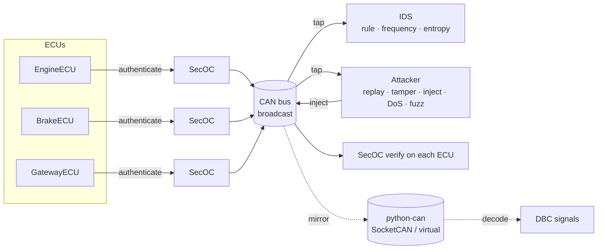

# Architecture

The simulator is a small, layered model of an in-vehicle network. Every component
is replaceable and individually testable; nothing depends on real hardware unless
you opt into the `python-can` backend.

## Component diagram

## Data flow for one frame

1. An ECU's **TX loop** builds an application frame (e.g. `ENGINE_RPM`).
2. The ECU's **`SecOCLayer.authenticate`** stamps a timestamp, draws the next
   **Freshness Value** for that Data ID, and attaches a truncated HMAC over
   `Data ID | DLC | data | freshness | timestamp`.
3. The frame is broadcast on the **bus**. Every other node receives a copy; the
   sender does not receive its own frame (classic-CAN semantics).
4. Passive **taps** receive a copy too — the `Attacker` (to sniff) and the `IDS`
   (to monitor). On the hardware backend the frame is also mirrored to the wire.
5. Each receiving ECU's **RX loop** calls **`SecOCLayer.verify`**: MAC check →
   freshness check → timestamp check. Accepted frames are processed; rejected
   frames are logged with a reason.

## Key modules

| Module | Responsibility |
| --- | --- |
| `can.message` | `CANMessage` frame model (python-can-aligned field names) |
| `can.bus` | broadcast `VirtualCANBus`, tap mechanism, `_mirror` hook |
| `can.socketcan` | `python-can` bridge (SocketCAN / virtual interface) |
| `can.dbc` | DBC decoding via `cantools` (+ stdlib fallback) |
| `security.crypto` | HMAC primitives, key derivation, constant-time verify |
| `security.freshness` | per-Data-ID Freshness Value manager |
| `security.secoc` | per-ECU authenticator / verifier facade |
| `ecu.*` | Engine, Brake, Gateway ECUs (threaded TX/RX) |
| `attacks.*` | replay, tamper, injection, DoS, fuzz |
| `ids.*` | detectors + confusion-matrix metrics |
| `uds.*` | ISO-TP, services, server, client, security access, attack |
| `telemetry.*` | logging + charts |
| `scenarios.*` | runner, scenario library, CLI |

## Threading model

Each ECU runs two daemon threads (TX and RX), mirroring an RTOS task split. The
`VirtualCANBus` delivers synchronously by default (deterministic for tests) and
on a short-lived thread only when an artificial propagation `delay_ms` is set.
The `IDS` serialises all detector state and metric updates behind a lock because
the bus calls `observe()` from every producer thread.

## Design choices worth noting

- **Field names mirror `python-can`** (`arbitration_id`, `data`, `dlc`,
  `is_extended_id`) so the hardware backend converts with no impedance mismatch.
- **CAN-FD on the wire**: the secured PDU (data + freshness + MAC + timestamp)
  exceeds 8 bytes, so the hardware backend uses CAN-FD — the same reason real
  SecOC deployments favour CAN-FD.
- **Taps, not polling**: sniffers and the IDS are passive observers, matching how
  a real bus monitor or rogue device sees traffic.
